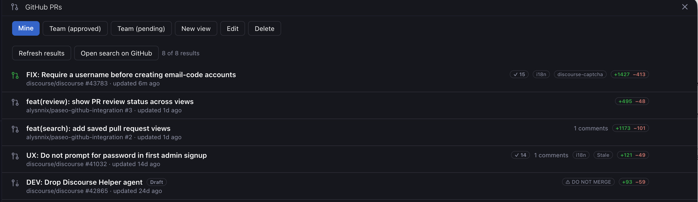

# GitHub PR Views for Paseo

Keep track of GitHub pull requests from Paseo with saved searches, background checks, and quick access to workspace chats.



- Create named views using GitHub search queries. The default **Mine** view shows your open PRs and can be edited or removed.
- See review status, CI checks, labels, comments, and lines added or deleted.
- Read PR details in Paseo, open them on GitHub, or start a workspace chat.
- Get green-dot indicators when new PRs match your views.

## Install

Requires Paseo 0.8+ and the GitHub CLI authenticated with `gh auth login` on the machine running Paseo’s daemon.

```sh
paseo plugin add pmusaraj/paseo-pr-views
```

Open **GitHub PRs** in the sidebar. Choose **New view**, enter a name and query, then save. Queries support GitHub filters, AND/OR, and relative dates such as `created:>@today-30d`.

To start a workspace chat, add the PR’s repository as a Paseo project first. You can review the prompt and model before launching.

## Background checks

Edit a view and enable **Add background check**. For existing views, the checkbox saves immediately.

Checks run every 10 minutes while the daemon is running, even with the view closed. The first check establishes a baseline; newly matching PRs then add green dots to the view and sidebar. Opening the view refreshes its results and clears its dot.

Background checks support views with up to 1,000 results.

## Credits

Based on [paseo-github-integration](https://github.com/alysnnix/paseo-github-integration). MIT licensed.
